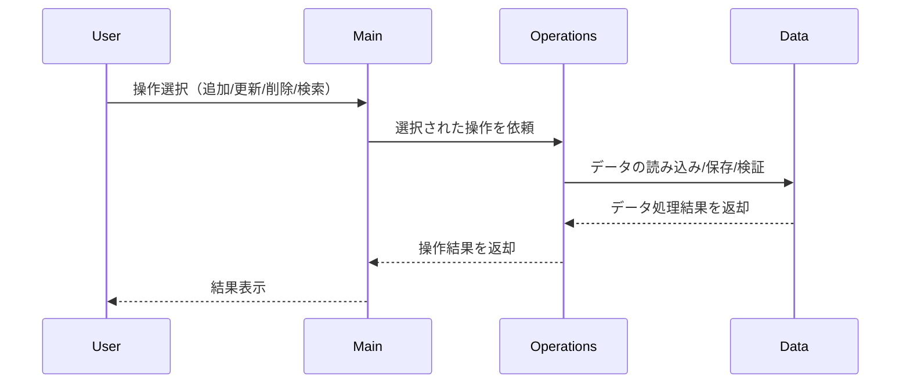

# COBOL Source Documentation

このプロジェクトは、学生アカウント管理に関するレガシーCOBOLコードを現代化することを目的としています。以下は各COBOLファイルの目的、主要な機能、および学生アカウントに関するビジネスルールの概要です。

## ファイル構成

### src/cobol/main.cob
- **目的**: プログラムのエントリーポイント。全体の制御フローを管理し、他のモジュール（operations.cob, data.cob）を呼び出します。
- **主な機能**:
  - ユーザー入力の受付
  - 学生アカウントの操作選択（追加、更新、削除など）
  - エラー処理と結果表示
- **ビジネスルール**:
  - 学生IDの一意性チェック
  - 操作権限の検証

### src/cobol/operations.cob
- **目的**: 学生アカウントに対する各種操作（追加、更新、削除、検索など）を実装。
- **主な機能**:
  - 学生アカウントの追加（新規登録）
  - 学生情報の更新
  - 学生アカウントの削除
  - 学生情報の検索
- **ビジネスルール**:
  - アカウント追加時、必要項目（氏名、学籍番号、入学年度など）の入力必須
  - 更新・削除時、対象学生の存在確認
  - 検索時、条件（学籍番号、氏名など）によるフィルタリング

### src/cobol/data.cob
- **目的**: 学生アカウントデータの定義と管理。データ構造やストレージに関する処理を担当。
- **主な機能**:
  - 学生アカウントのデータ構造定義
  - データの読み込み・保存
  - データ整合性の維持
- **ビジネスルール**:
  - データ保存時、重複や欠損のチェック
  - データ整合性の担保（例：学籍番号のフォーマット検証）

---

このドキュメントは、COBOLコードの現代化や保守作業を行う際の参考となるよう、各ファイルの役割とビジネスルールをまとめています。

---

## シーケンス図（Mermaid形式）

